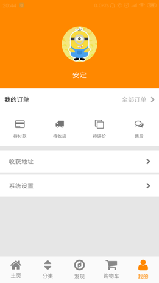

# YiGou

APK体验扫描底部二维码。

一个仿小米商城的Android客户端，本项目是由[电商实战](https://coding.imooc.com/class/116.html)项目的开源版，在旧版的话修复了若干Bug,并对AS3.0做出兼容，优化一些UI界面，但还有诸多模块需要改进，觉得不错的话，希望各位小伙伴Star一下，对代码写的有意见的，欢迎Issues和Pull Requests， 

# screenshot

我也会持续关注并改进这个项目。

## 技术包含 

* 高性能单Activity多Fragmen架构设计
* 高性能网络框架(Retrofit、RxJava)封装
* 字体图标App瘦身解决方案
* 封装自己的WebView框架
* 微信登录
* 第三方支付(微信、支付宝)
* 极光推送 MOB分享一键式集成
* 自定义第三方控件
* CoordinatorLayout、透明渐变ToolBar
* 二维码、搜索、一键式6.0权限集成
* 缓存、文件、动态权限、Log等处理工具
* ...

## Thanks to the open source project

* [RxJava](https://github.com/ReactiveX/RxJava)
* [RxAndroid](https://github.com/ReactiveX/RxAndroid)
* [okhttp](https://github.com/square/okhttp)
* [retrofit](https://github.com/square/retrofit)
* [DanmakuFlameMaster](https://github.com/Bilibili/DanmakuFlameMaster)
* [butterknife](https://github.com/JakeWharton/butterknife)
* [glide](https://github.com/bumptech/glide)
* ...

## Statement
本程序仅供学习交流, 不可用于任何商业用途！如产生侵权行为，请与我联系QQ:916126728

### app体验链接

## 协议

DoraemonKit 基于 Apache-2.0 协议进行分发和使用，更多信息参见 [协议文件](LICENSE)。

